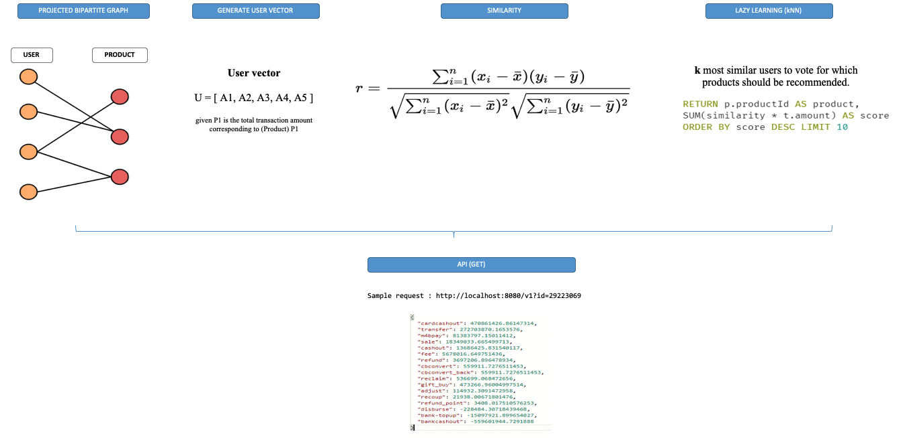
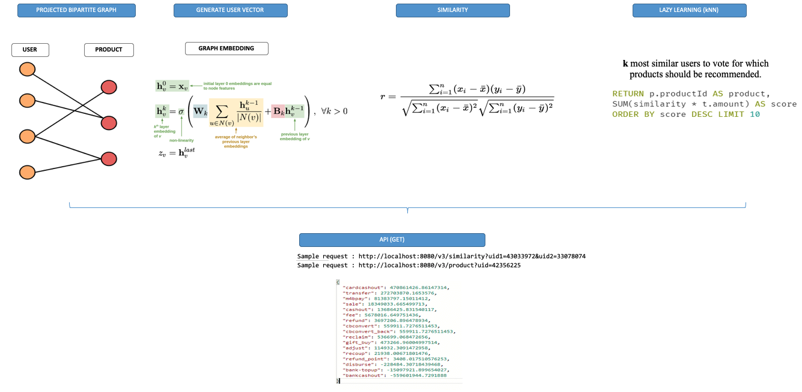
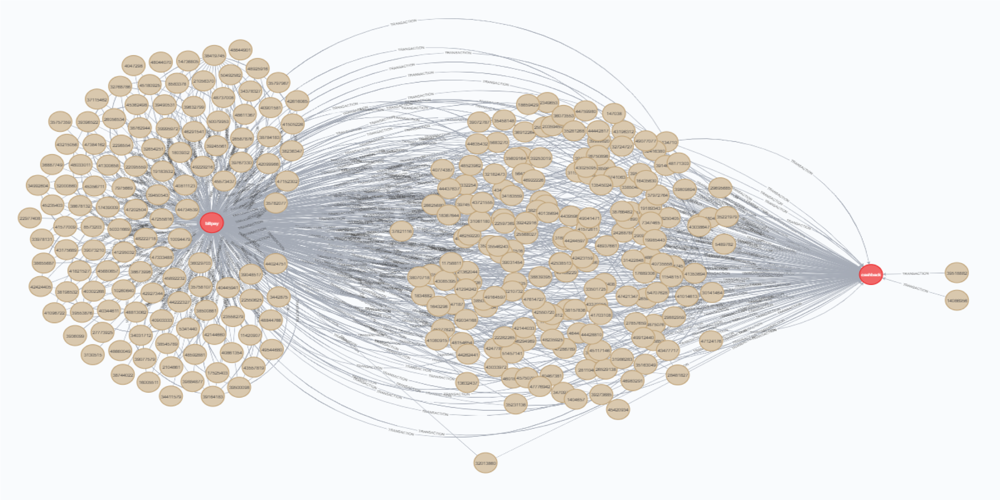

# Simplified version of a graph-based recommender

"""

Creator: khanh.brandy
Created on 2020-06-30

"""

This source code works well with Neo4j 4.2 and is distributed in the hope that it will be useful, but WITHOUT ANY WARRANTY.

**V1.1 DESCRIPTION**

- User-Product Bipartite graph
- Use TRANSACTION (consider every single transaction and its amount)
- Do not use Neo4j procedure to calculate similarity score
- Cannot be used to extract and return ordered recommended items on a realtime basis 

**V1.2 UPDATES**

- Inherit Bipartite graph structure from v1
- Try using TOTAL_AMT as the only relationship property with TOTAL_AMT = SUM(all transactions from node N to product P)
- Use Neo4j procedure to calculate similarity score
- Store similarity score between nodes as a new relationship [SIMILAR]
- Can be used to extract and return ordered recommended items on a realtime basis 

  

**V1.3 UPDATES**

- Inherit graph structure, node properties (es SIMILAR) and relationship properties (es TOTAL_AMT) from v2
- Add more node properties then try using node embedded vector to calculate COSINE similarity score (from projected user-product Bipartite graph) along with (or instead of) using item-based vectors

  

**V1.4 UPDATES**

- Load original transactional graph then compute and store node embedded vector as a node property
- Build user-product Bipartite graph (using TOTAL_AMT as relationship)

  

